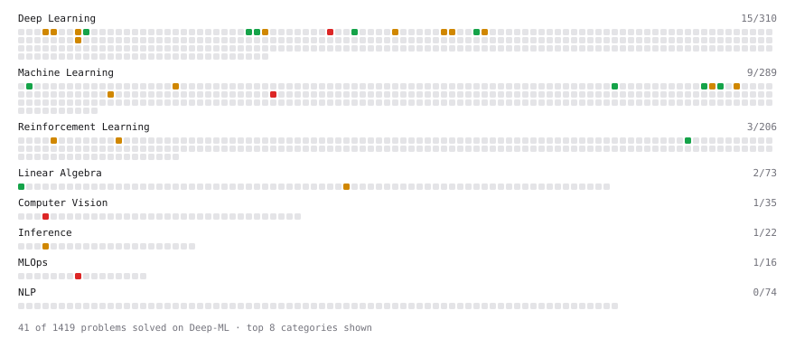

# Deep-ML

My machine learning practice from [Deep-ML](https://www.deep-ml.com). Every solution here was written by hand.

**15** solved · 15 problems · 0 labs · 0 math

[**Browse the interactive portfolio**](https://Zero-203.github.io/deep-ml/) to replay this filling in over time.

## Problems

| | Difficulty | Solved | |
| --- | --- | --- | --- |
| [Estimate Action Values Using Sample Averaging](https://www.deep-ml.com/problems/543) | easy | 2026-04-21 | [solution](problems/0543-estimate-action-values-using-sample-averaging) |
| [Implement a Simple Residual Block with Shortcut Connection](https://www.deep-ml.com/problems/113) | easy | 2026-04-15 | [solution](problems/0113-implement-a-simple-residual-block-with-shortcut-connection) |
| [Implement Global Average Pooling](https://www.deep-ml.com/problems/114) | easy | 2026-04-16 | [solution](problems/0114-implement-global-average-pooling) |
| [Implement ReLU Activation Function](https://www.deep-ml.com/problems/42) | easy | 2026-04-12 | [solution](problems/0042-implement-relu-activation-function) |
| [Matrix-Vector Dot Product](https://www.deep-ml.com/problems/1) | easy | 2026-04-17 | [solution](problems/0001-matrix-vector-dot-product) |
| [Dropout Layer](https://www.deep-ml.com/problems/151) | medium | 2026-04-14 | [solution](problems/0151-dropout-layer) |
| [Implement Batch Normalization for BCHW Input](https://www.deep-ml.com/problems/115) | medium | 2026-04-16 | [solution](problems/0115-implement-batch-normalization-for-bchw-input) |
| [Implement K-Means++ Initialization](https://www.deep-ml.com/problems/362) | medium | 2026-04-18 | [solution](problems/0362-implement-k-means-initialization) |
| [Implement Local Response Normalization (LRN)](https://www.deep-ml.com/problems/189) | medium | 2026-04-13 | [solution](problems/0189-implement-local-response-normalization-lrn) |
| [Implement the Bellman Equation for Value Iteration](https://www.deep-ml.com/problems/157) | medium | 2026-04-20 | [solution](problems/0157-implement-the-bellman-equation-for-value-iteration) |
| [Overlapping Max Pooling](https://www.deep-ml.com/problems/190) | medium | 2026-04-13 | [solution](problems/0190-overlapping-max-pooling) |
| [Simple Convolutional 2D Layer](https://www.deep-ml.com/problems/41) | medium | 2026-04-12 | [solution](problems/0041-simple-convolutional-2d-layer) |
| [Single Neuron with Backpropagation](https://www.deep-ml.com/problems/25) | medium | 2026-04-15 | [solution](problems/0025-single-neuron-with-backpropagation) |
| [Implement a Dense Block with 2D Convolutions](https://www.deep-ml.com/problems/137) | hard | 2026-04-20 | [solution](problems/0137-implement-a-dense-block-with-2d-convolutions) |
| [PCA Color Augmentation](https://www.deep-ml.com/problems/191) | hard | 2026-04-14 | [solution](problems/0191-pca-color-augmentation) |

---

_This file is regenerated by Deep-ML on every push._
