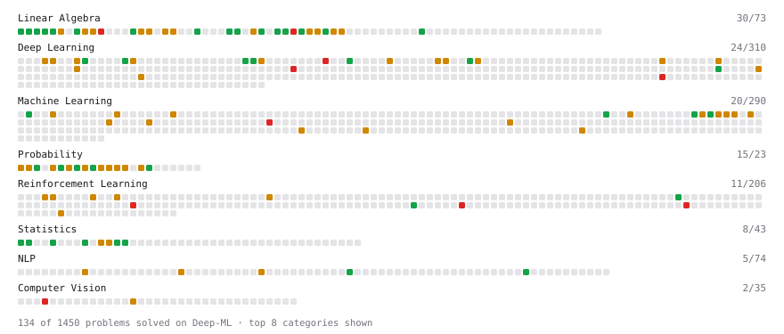

# Deep-ML

My machine learning practice from [Deep-ML](https://www.deep-ml.com). Every solution here was written by hand.

**Completed:** Calculus (9/9)

**184** solved · 172 problems · 6 labs · 6 math

[**Browse the interactive portfolio**](https://Zero-203.github.io/deep-ml/) to replay this filling in over time.

## Problems

| | Difficulty | Solved | |
| --- | --- | --- | --- |
| [Build Attention Mask from Pad Tokens](https://www.deep-ml.com/problems/1064) | easy | 2026-06-01 | [solution](problems/1064-build-attention-mask-from-pad-tokens) |
| [Calculate 2x2 Matrix Inverse](https://www.deep-ml.com/problems/8) | easy | 2026-05-06 | [solution](problems/0008-calculate-2x2-matrix-inverse) |
| [Calculate Conditional Probability from Data](https://www.deep-ml.com/problems/168) | easy | 2026-05-28 | [solution](problems/0168-calculate-conditional-probability-from-data) |
| [Calculate Cosine Similarity Between Vectors](https://www.deep-ml.com/problems/76) | easy | 2026-05-03 | [solution](problems/0076-calculate-cosine-similarity-between-vectors) |
| [Calculate Covariance Matrix](https://www.deep-ml.com/problems/10) | easy | 2026-05-20 | [solution](problems/0010-calculate-covariance-matrix) |
| [Calculate Mean by Row or Column](https://www.deep-ml.com/problems/4) | easy | 2026-05-06 | [solution](problems/0004-calculate-mean-by-row-or-column) |
| [Calculate P50/P95/P99 Latency Percentiles](https://www.deep-ml.com/problems/293) | easy | 2026-05-24 | [solution](problems/0293-calculate-p50-p95-p99-latency-percentiles) |
| [Calculate SVM Margin Width](https://www.deep-ml.com/problems/282) | easy | 2026-04-25 | [solution](problems/0282-calculate-svm-margin-width) |
| [Check Linear Independence of Vectors](https://www.deep-ml.com/problems/331) | easy | 2026-05-10 | [solution](problems/0331-check-linear-independence-of-vectors) |
| [Compare Naive vs Stable Softmax for Attention Scores](https://www.deep-ml.com/problems/962) | easy | 2026-07-11 | [solution](problems/0962-compare-naive-vs-stable-softmax-for-attention-scores) |
| [Compute a Gradient with PyTorch Autograd](https://www.deep-ml.com/problems/884) | easy | 2026-06-26 | [solution](problems/0884-compute-a-gradient-with-pytorch-autograd) |
| [Compute Discounted Return](https://www.deep-ml.com/problems/165) | easy | 2026-06-13 | [solution](problems/0165-compute-discounted-return) |
| [Compute Posterior Probability using Bayes' Theorem](https://www.deep-ml.com/problems/336) | easy | 2026-05-28 | [solution](problems/0336-compute-posterior-probability-using-bayes-theorem) |
| [Compute PSNR for Image Reconstruction Quality](https://www.deep-ml.com/problems/713) | easy | 2026-07-15 | [solution](problems/0713-compute-psnr-for-image-reconstruction-quality) |
| [Compute the Cross Product of Two 3D Vectors](https://www.deep-ml.com/problems/118) | easy | 2026-05-03 | [solution](problems/0118-compute-the-cross-product-of-two-3d-vectors) |
| [Convert Vector to Diagonal Matrix](https://www.deep-ml.com/problems/35) | easy | 2026-05-06 | [solution](problems/0035-convert-vector-to-diagonal-matrix) |
| [Demonstrate Law of Large Numbers with Sampling](https://www.deep-ml.com/problems/342) | easy | 2026-06-01 | [solution](problems/0342-demonstrate-law-of-large-numbers-with-sampling) |
| [Derivative of a Polynomial](https://www.deep-ml.com/problems/116) | easy | 2026-04-24 | [solution](problems/0116-derivative-of-a-polynomial) |
| [Derivatives of Activation Functions](https://www.deep-ml.com/problems/217) | easy | 2026-04-26 | [solution](problems/0217-derivatives-of-activation-functions) |
| [Descriptive Statistics Calculator](https://www.deep-ml.com/problems/78) | easy | 2026-05-23 | [solution](problems/0078-descriptive-statistics-calculator) |
| [Dot Product Calculator](https://www.deep-ml.com/problems/83) | easy | 2026-05-03 | [solution](problems/0083-dot-product-calculator) |
| [Empirical Probability Mass Function (PMF)](https://www.deep-ml.com/problems/184) | easy | 2026-05-26 | [solution](problems/0184-empirical-probability-mass-function-pmf) |
| [Episodic Info Dictionary Aggregation](https://www.deep-ml.com/problems/665) | easy | 2026-06-28 | [solution](problems/0665-episodic-info-dictionary-aggregation) |
| [Estimate Action Values Using Sample Averaging](https://www.deep-ml.com/problems/543) | easy | 2026-04-21 | [solution](problems/0543-estimate-action-values-using-sample-averaging) |
| [Estimate Minimum GPU Count for Model Deployment](https://www.deep-ml.com/problems/412) | easy | 2026-05-21 | [solution](problems/0412-estimate-minimum-gpu-count-for-model-deployment) |
| [Expected Value and Variance of an n-Sided Die](https://www.deep-ml.com/problems/179) | easy | 2026-05-26 | [solution](problems/0179-expected-value-and-variance-of-an-n-sided-die) |
| [Exponential Distribution PDF and CDF](https://www.deep-ml.com/problems/340) | easy | 2026-05-29 | [solution](problems/0340-exponential-distribution-pdf-and-cdf) |
| [Gradient Direction and Magnitude](https://www.deep-ml.com/problems/308) | easy | 2026-04-24 | [solution](problems/0308-gradient-direction-and-magnitude) |
| [Implement a Simple Residual Block with Shortcut Connection](https://www.deep-ml.com/problems/113) | easy | 2026-04-15 | [solution](problems/0113-implement-a-simple-residual-block-with-shortcut-connection) |
| [Implement Global Average Pooling](https://www.deep-ml.com/problems/114) | easy | 2026-04-16 | [solution](problems/0114-implement-global-average-pooling) |
| [Implement Orthogonal Projection of a Vector onto a Line](https://www.deep-ml.com/problems/66) | easy | 2026-05-19 | [solution](problems/0066-implement-orthogonal-projection-of-a-vector-onto-a-line) |
| [Implement ReLU Activation Function](https://www.deep-ml.com/problems/42) | easy | 2026-04-12 | [solution](problems/0042-implement-relu-activation-function) |
| [Implement SwiGLU activation function](https://www.deep-ml.com/problems/156) | easy | 2026-07-01 | [solution](problems/0156-implement-swiglu-activation-function) |
| [KL Divergence Between Two Normal Distributions](https://www.deep-ml.com/problems/56) | easy | 2026-06-04 | [solution](problems/0056-kl-divergence-between-two-normal-distributions) |
| [L2 Normalization Along an Axis](https://www.deep-ml.com/problems/1022) | easy | 2026-05-23 | [solution](problems/1022-l2-normalization-along-an-axis) |
| [Linear Regression Using Gradient Descent](https://www.deep-ml.com/problems/15) | easy | 2026-04-28 | [solution](problems/0015-linear-regression-using-gradient-descent) |
| [Matrix Determinant & Trace](https://www.deep-ml.com/problems/195) | easy | 2026-05-06 | [solution](problems/0195-matrix-determinant-trace) |
| [Matrix-Vector Dot Product](https://www.deep-ml.com/problems/1) | easy | 2026-04-17 | [solution](problems/0001-matrix-vector-dot-product) |
| [Model FLOPs Utilization (MFU) Calculator](https://www.deep-ml.com/problems/789) | easy | 2026-06-10 | [solution](problems/0789-model-flops-utilization-mfu-calculator) |
| [Momentum Optimizer](https://www.deep-ml.com/problems/146) | easy | 2026-04-28 | [solution](problems/0146-momentum-optimizer) |
| [Poisson Distribution Probability Calculator](https://www.deep-ml.com/problems/81) | easy | 2026-05-29 | [solution](problems/0081-poisson-distribution-probability-calculator) |
| [Quality Filtering with Rejection Sampling](https://www.deep-ml.com/problems/508) | easy | 2026-06-12 | [solution](problems/0508-quality-filtering-with-rejection-sampling) |
| [Regex-Based Text Tokenizer](https://www.deep-ml.com/problems/940) | easy | 2026-06-02 | [solution](problems/0940-regex-based-text-tokenizer) |
| [Reshape Matrix](https://www.deep-ml.com/problems/3) | easy | 2026-05-06 | [solution](problems/0003-reshape-matrix) |
| [Sampling Distribution of the Mean](https://www.deep-ml.com/problems/181) | easy | 2026-04-30 | [solution](problems/0181-sampling-distribution-of-the-mean) |
| [Scalar Multiplication of a Matrix](https://www.deep-ml.com/problems/5) | easy | 2026-05-06 | [solution](problems/0005-scalar-multiplication-of-a-matrix) |
| [Step-Size Selection for Tile Coding](https://www.deep-ml.com/problems/608) | easy | 2026-05-02 | [solution](problems/0608-step-size-selection-for-tile-coding) |
| [Stop-Gradient Operator in Jointly Trained Models](https://www.deep-ml.com/problems/711) | easy | 2026-05-18 | [solution](problems/0711-stop-gradient-operator-in-jointly-trained-models) |
| [Tanh Logit Soft-Capping](https://www.deep-ml.com/problems/1049) | easy | 2026-06-25 | [solution](problems/1049-tanh-logit-soft-capping) |
| [Taylor Series Approximation](https://www.deep-ml.com/problems/310) | easy | 2026-04-28 | [solution](problems/0310-taylor-series-approximation) |
| [Transpose of a Matrix](https://www.deep-ml.com/problems/2) | easy | 2026-05-06 | [solution](problems/0002-transpose-of-a-matrix) |
| [Triton: Vector Addition Kernel](https://www.deep-ml.com/problems/968) | easy | 2026-06-07 | [solution](problems/0968-triton-vector-addition-kernel) |
| [Vector Element-wise Sum](https://www.deep-ml.com/problems/121) | easy | 2026-05-03 | [solution](problems/0121-vector-element-wise-sum) |
| [Vector Norms (L1/L2/L-inf) and the Frobenius Norm](https://www.deep-ml.com/problems/328) | easy | 2026-05-06 | [solution](problems/0328-vector-norms-l1-l2-l-inf-and-the-frobenius-norm) |
| [Asynchronous Dynamic Programming for Value Iteration](https://www.deep-ml.com/problems/468) | medium | 2026-05-26 | [solution](problems/0468-asynchronous-dynamic-programming-for-value-iteration) |
| [BatchNorm1d Supporting 2D and 3D Inputs](https://www.deep-ml.com/problems/1005) | medium | 2026-06-29 | [solution](problems/1005-batchnorm1d-supporting-2d-and-3d-inputs) |
| [Bayesian Inference for Beta-Binomial Model](https://www.deep-ml.com/problems/213) | medium | 2026-07-07 | [solution](problems/0213-bayesian-inference-for-beta-binomial-model) |
| [Beta Distribution PDF and Statistics](https://www.deep-ml.com/problems/339) | medium | 2026-05-31 | [solution](problems/0339-beta-distribution-pdf-and-statistics) |
| [Binomial Distribution Probability](https://www.deep-ml.com/problems/79) | medium | 2026-05-29 | [solution](problems/0079-binomial-distribution-probability) |
| [BLEU Score for Text Generation](https://www.deep-ml.com/problems/321) | medium | 2026-05-08 | [solution](problems/0321-bleu-score-for-text-generation) |
| [Blocking Maze Environment for Testing Dyna-Q+](https://www.deep-ml.com/problems/565) | medium | 2026-06-20 | [solution](problems/0565-blocking-maze-environment-for-testing-dyna-q) |
| [Calculate Correlation Matrix](https://www.deep-ml.com/problems/37) | medium | 2026-05-21 | [solution](problems/0037-calculate-correlation-matrix) |
| [Calculate Eigenvalues of a Matrix](https://www.deep-ml.com/problems/6) | medium | 2026-05-10 | [solution](problems/0006-calculate-eigenvalues-of-a-matrix) |
| [Calculate KL Divergence Between Two Multivariate Gaussian Distributions](https://www.deep-ml.com/problems/136) | medium | 2026-06-04 | [solution](problems/0136-calculate-kl-divergence-between-two-multivariate-gaussian-distributions) |
| [Calculate Number of Parameters in Neural Network](https://www.deep-ml.com/problems/291) | medium | 2026-05-31 | [solution](problems/0291-calculate-number-of-parameters-in-neural-network) |
| [Calculate Statistical Power for Experiment Design](https://www.deep-ml.com/problems/296) | medium | 2026-06-10 | [solution](problems/0296-calculate-statistical-power-for-experiment-design) |
| [Central Limit Theorem Simulation](https://www.deep-ml.com/problems/182) | medium | 2026-06-01 | [solution](problems/0182-central-limit-theorem-simulation) |
| [Chain Rule for Composite Functions](https://www.deep-ml.com/problems/214) | medium | 2026-04-25 | [solution](problems/0214-chain-rule-for-composite-functions) |
| [Check if Matrix is Positive Definite](https://www.deep-ml.com/problems/332) | medium | 2026-05-19 | [solution](problems/0332-check-if-matrix-is-positive-definite) |
| [Chi-square Probability Distribution](https://www.deep-ml.com/problems/176) | medium | 2026-05-31 | [solution](problems/0176-chi-square-probability-distribution) |
| [Classify Critical Points Using Hessian Eigenvalues](https://www.deep-ml.com/problems/311) | medium | 2026-05-01 | [solution](problems/0311-classify-critical-points-using-hessian-eigenvalues) |
| [Classify LLM Prefill vs Decode as Compute-Bound or Memory-Bound](https://www.deep-ml.com/problems/417) | medium | 2026-04-29 | [solution](problems/0417-classify-llm-prefill-vs-decode-as-compute-bound-or-memory-bound) |
| [Code Execution Verifier for Programming Benchmarks](https://www.deep-ml.com/problems/324) | medium | 2026-06-06 | [solution](problems/0324-code-execution-verifier-for-programming-benchmarks) |
| [Compute Covariance from Joint Probability Mass Function](https://www.deep-ml.com/problems/243) | medium | 2026-05-28 | [solution](problems/0243-compute-covariance-from-joint-probability-mass-function) |
| [Compute Orthonormal Basis for 2D Vectors](https://www.deep-ml.com/problems/117) | medium | 2026-05-19 | [solution](problems/0117-compute-orthonormal-basis-for-2d-vectors) |
| [Compute the Hessian Matrix](https://www.deep-ml.com/problems/218) | medium | 2026-04-26 | [solution](problems/0218-compute-the-hessian-matrix) |
| [Compute the Null Space (Kernel) of a Matrix](https://www.deep-ml.com/problems/330) | medium | 2026-05-04 | [solution](problems/0330-compute-the-null-space-kernel-of-a-matrix) |
| [Compute Total Probability using Law of Total Probability](https://www.deep-ml.com/problems/244) | medium | 2026-05-28 | [solution](problems/0244-compute-total-probability-using-law-of-total-probability) |
| [Conditional Probability from Joint Distribution](https://www.deep-ml.com/problems/180) | medium | 2026-05-28 | [solution](problems/0180-conditional-probability-from-joint-distribution) |
| [Confidence Interval for Population Mean](https://www.deep-ml.com/problems/212) | medium | 2026-06-10 | [solution](problems/0212-confidence-interval-for-population-mean) |
| [DDIM Deterministic Sampling Step](https://www.deep-ml.com/problems/398) | medium | 2026-06-24 | [solution](problems/0398-ddim-deterministic-sampling-step) |
| [Decision Tree Pruning with Cost-Complexity](https://www.deep-ml.com/problems/285) | medium | 2026-05-13 | [solution](problems/0285-decision-tree-pruning-with-cost-complexity) |
| [Derivative of Cross-Entropy Loss w.r.t. Logits](https://www.deep-ml.com/problems/220) | medium | 2026-04-26 | [solution](problems/0220-derivative-of-cross-entropy-loss-w-r-t-logits) |
| [Derivative of Softmax](https://www.deep-ml.com/problems/219) | medium | 2026-04-26 | [solution](problems/0219-derivative-of-softmax) |
| [Dropout Layer](https://www.deep-ml.com/problems/151) | medium | 2026-04-14 | [solution](problems/0151-dropout-layer) |
| [Efficient Task Switching with LoRA Weight Swapping](https://www.deep-ml.com/problems/871) | medium | 2026-05-19 | [solution](problems/0871-efficient-task-switching-with-lora-weight-swapping) |
| [Elbow Method for K-Means](https://www.deep-ml.com/problems/827) | medium | 2026-06-27 | [solution](problems/0827-elbow-method-for-k-means) |
| [Engram Context-Aware Gating](https://www.deep-ml.com/problems/327) | medium | 2026-05-04 | [solution](problems/0327-engram-context-aware-gating) |
| [Entropy & Cross-Entropy](https://www.deep-ml.com/problems/205) | medium | 2026-06-02 | [solution](problems/0205-entropy-cross-entropy) |
| [Evaluate Expected Value in a Markov Decision Process](https://www.deep-ml.com/problems/166) | medium | 2026-04-28 | [solution](problems/0166-evaluate-expected-value-in-a-markov-decision-process) |
| [Expected vs Sample Updates Comparison](https://www.deep-ml.com/problems/566) | medium | 2026-07-06 | [solution](problems/0566-expected-vs-sample-updates-comparison) |
| [Find Captain Redbeard's Hidden Treasure](https://www.deep-ml.com/problems/127) | medium | 2026-04-29 | [solution](problems/0127-find-captain-redbeard-s-hidden-treasure) |
| [Gauss-Seidel Method for Solving Linear Systems](https://www.deep-ml.com/problems/57) | medium | 2026-05-18 | [solution](problems/0057-gauss-seidel-method-for-solving-linear-systems) |
| [Gaussian Elimination for Solving Linear Systems](https://www.deep-ml.com/problems/58) | medium | 2026-05-13 | [solution](problems/0058-gaussian-elimination-for-solving-linear-systems) |
| [Gaussian Mixture Model with EM Algorithm](https://www.deep-ml.com/problems/341) | medium | 2026-07-16 | [solution](problems/0341-gaussian-mixture-model-with-em-algorithm) |
| [Generate Random Subsets of a Dataset](https://www.deep-ml.com/problems/33) | medium | 2026-05-27 | [solution](problems/0033-generate-random-subsets-of-a-dataset) |
| [Gradient Bandit Action Selection](https://www.deep-ml.com/problems/163) | medium | 2026-06-04 | [solution](problems/0163-gradient-bandit-action-selection) |
| [Greedy Streaming Decoder with KV Cache](https://www.deep-ml.com/problems/1055) | medium | 2026-07-03 | [solution](problems/1055-greedy-streaming-decoder-with-kv-cache) |
| [Gridworld Policy Evaluation](https://www.deep-ml.com/problems/142) | medium | 2026-05-15 | [solution](problems/0142-gridworld-policy-evaluation) |
| [Handling Variable Environment Reset Times](https://www.deep-ml.com/problems/677) | medium | 2026-05-20 | [solution](problems/0677-handling-variable-environment-reset-times) |
| [Hash Function for Tile Coding](https://www.deep-ml.com/problems/644) | medium | 2026-05-16 | [solution](problems/0644-hash-function-for-tile-coding) |
| [Hypergeometric Distribution PMF](https://www.deep-ml.com/problems/245) | medium | 2026-05-31 | [solution](problems/0245-hypergeometric-distribution-pmf) |
| [Implement Batch Normalization for BCHW Input](https://www.deep-ml.com/problems/115) | medium | 2026-04-16 | [solution](problems/0115-implement-batch-normalization-for-bchw-input) |
| [Implement Gated Attention](https://www.deep-ml.com/problems/271) | medium | 2026-06-14 | [solution](problems/0271-implement-gated-attention) |
| [Implement Gradient Descent Variants with MSE Loss](https://www.deep-ml.com/problems/47) | medium | 2026-04-28 | [solution](problems/0047-implement-gradient-descent-variants-with-mse-loss) |
| [Implement Isolation Forest for Anomaly Detection](https://www.deep-ml.com/problems/367) | medium | 2026-05-29 | [solution](problems/0367-implement-isolation-forest-for-anomaly-detection) |
| [Implement K-Fold Cross-Validation](https://www.deep-ml.com/problems/18) | medium | 2026-05-05 | [solution](problems/0018-implement-k-fold-cross-validation) |
| [Implement K-Means++ Initialization](https://www.deep-ml.com/problems/362) | medium | 2026-04-18 | [solution](problems/0362-implement-k-means-initialization) |
| [Implement Layer Normalization for Sequence Data](https://www.deep-ml.com/problems/109) | medium | 2026-06-09 | [solution](problems/0109-implement-layer-normalization-for-sequence-data) |
| [Implement Local Response Normalization (LRN)](https://www.deep-ml.com/problems/189) | medium | 2026-04-13 | [solution](problems/0189-implement-local-response-normalization-lrn) |
| [Implement Long Short-Term Memory (LSTM) Network](https://www.deep-ml.com/problems/59) | medium | 2026-05-07 | [solution](problems/0059-implement-long-short-term-memory-lstm-network) |
| [Implement Reduced Row Echelon Form (RREF) Function](https://www.deep-ml.com/problems/48) | medium | 2026-05-18 | [solution](problems/0048-implement-reduced-row-echelon-form-rref-function) |
| [Implement TF-IDF (Term Frequency-Inverse Document Frequency)](https://www.deep-ml.com/problems/60) | medium | 2026-06-23 | [solution](problems/0060-implement-tf-idf-term-frequency-inverse-document-frequency) |
| [Implement the Bellman Equation for Value Iteration](https://www.deep-ml.com/problems/157) | medium | 2026-04-20 | [solution](problems/0157-implement-the-bellman-equation-for-value-iteration) |
| [Implementing Basic Autograd Operations](https://www.deep-ml.com/problems/26) | medium | 2026-04-27 | [solution](problems/0026-implementing-basic-autograd-operations) |
| [Inverse Dynamics Model for Unsupervised Action Labeling](https://www.deep-ml.com/problems/717) | medium | 2026-05-09 | [solution](problems/0717-inverse-dynamics-model-for-unsupervised-action-labeling) |
| [Jacobian Matrix Calculation](https://www.deep-ml.com/problems/202) | medium | 2026-04-26 | [solution](problems/0202-jacobian-matrix-calculation) |
| [Jensen-Shannon Divergence](https://www.deep-ml.com/problems/203) | medium | 2026-05-06 | [solution](problems/0203-jensen-shannon-divergence) |
| [Lagrange Multipliers for Constrained Quadratic Optimization](https://www.deep-ml.com/problems/314) | medium | 2026-05-01 | [solution](problems/0314-lagrange-multipliers-for-constrained-quadratic-optimization) |
| [Lazy Teacher Logit Reconstruction from Cached Hidden States](https://www.deep-ml.com/problems/746) | medium | 2026-07-05 | [solution](problems/0746-lazy-teacher-logit-reconstruction-from-cached-hidden-states) |
| [Learning Curve Generator for Bias-Variance Diagnosis](https://www.deep-ml.com/problems/800) | medium | 2026-07-02 | [solution](problems/0800-learning-curve-generator-for-bias-variance-diagnosis) |
| [Lock-Free Synchronization with Shared Flags](https://www.deep-ml.com/problems/658) | medium | 2026-05-17 | [solution](problems/0658-lock-free-synchronization-with-shared-flags) |
| [LU Decomposition of a Square Matrix](https://www.deep-ml.com/problems/333) | medium | 2026-04-26 | [solution](problems/0333-lu-decomposition-of-a-square-matrix) |
| [Matrix Rank](https://www.deep-ml.com/problems/329) | medium | 2026-05-10 | [solution](problems/0329-matrix-rank) |
| [Matrix times Matrix ](https://www.deep-ml.com/problems/9) | medium | 2026-05-06 | [solution](problems/0009-matrix-times-matrix) |
| [Maximum A Posteriori (MAP) Estimation for Bernoulli Parameter](https://www.deep-ml.com/problems/338) | medium | 2026-06-08 | [solution](problems/0338-maximum-a-posteriori-map-estimation-for-bernoulli-parameter) |
| [Maximum Likelihood Estimation for Gaussian Distribution](https://www.deep-ml.com/problems/337) | medium | 2026-06-08 | [solution](problems/0337-maximum-likelihood-estimation-for-gaussian-distribution) |
| [MMLU Log-Probability Scoring](https://www.deep-ml.com/problems/316) | medium | 2026-06-16 | [solution](problems/0316-mmlu-log-probability-scoring) |
| [Multi-Token Prediction Training Objective](https://www.deep-ml.com/problems/745) | medium | 2026-05-03 | [solution](problems/0745-multi-token-prediction-training-objective) |
| [Mutual Information](https://www.deep-ml.com/problems/204) | medium | 2026-06-02 | [solution](problems/0204-mutual-information) |
| [N-gram Overlap Contamination Detection](https://www.deep-ml.com/problems/767) | medium | 2026-05-10 | [solution](problems/0767-n-gram-overlap-contamination-detection) |
| [Negative Binomial Distribution Probability](https://www.deep-ml.com/problems/247) | medium | 2026-05-31 | [solution](problems/0247-negative-binomial-distribution-probability) |
| [Newton's Method for Optimization](https://www.deep-ml.com/problems/221) | medium | 2026-04-29 | [solution](problems/0221-newton-s-method-for-optimization) |
| [Normal Distribution PDF Calculator](https://www.deep-ml.com/problems/80) | medium | 2026-05-29 | [solution](problems/0080-normal-distribution-pdf-calculator) |
| [Novel View Synthesis with Depth Reprojection](https://www.deep-ml.com/problems/499) | medium | 2026-06-08 | [solution](problems/0499-novel-view-synthesis-with-depth-reprojection) |
| [Numerical Gradient Checking](https://www.deep-ml.com/problems/313) | medium | 2026-04-27 | [solution](problems/0313-numerical-gradient-checking) |
| [Optical Flow EPE with Masks (OmniWorld-style metric)](https://www.deep-ml.com/problems/185) | medium | 2026-07-07 | [solution](problems/0185-optical-flow-epe-with-masks-omniworld-style-metric) |
| [Ordinal Encoding for Categorical Features](https://www.deep-ml.com/problems/843) | medium | 2026-05-28 | [solution](problems/0843-ordinal-encoding-for-categorical-features) |
| [Overlapping Max Pooling](https://www.deep-ml.com/problems/190) | medium | 2026-04-13 | [solution](problems/0190-overlapping-max-pooling) |
| [Partial Derivatives of Multivariable Functions](https://www.deep-ml.com/problems/215) | medium | 2026-04-25 | [solution](problems/0215-partial-derivatives-of-multivariable-functions) |
| [Perceptual Image Distance from Deep Features](https://www.deep-ml.com/problems/687) | medium | 2026-07-12 | [solution](problems/0687-perceptual-image-distance-from-deep-features) |
| [Prioritized Experience Replay](https://www.deep-ml.com/problems/591) | medium | 2026-06-19 | [solution](problems/0591-prioritized-experience-replay) |
| [Product Rule for Derivatives](https://www.deep-ml.com/problems/309) | medium | 2026-04-25 | [solution](problems/0309-product-rule-for-derivatives) |
| [Quotient Rule for Derivatives](https://www.deep-ml.com/problems/312) | medium | 2026-04-25 | [solution](problems/0312-quotient-rule-for-derivatives) |
| [RL Backup Diagram Generator](https://www.deep-ml.com/problems/613) | medium | 2026-07-16 | [solution](problems/0613-rl-backup-diagram-generator) |
| [Rotary Positional Embeddings (RoPE)](https://www.deep-ml.com/problems/381) | medium | 2026-04-23 | [solution](problems/0381-rotary-positional-embeddings-rope) |
| [Self-Critique Loss for Constitutional AI](https://www.deep-ml.com/problems/863) | medium | 2026-06-19 | [solution](problems/0863-self-critique-loss-for-constitutional-ai) |
| [Simple Convolutional 2D Layer](https://www.deep-ml.com/problems/41) | medium | 2026-04-12 | [solution](problems/0041-simple-convolutional-2d-layer) |
| [Simulate Markov Chain Transitions](https://www.deep-ml.com/problems/132) | medium | 2026-07-16 | [solution](problems/0132-simulate-markov-chain-transitions) |
| [Single Neuron with Backpropagation](https://www.deep-ml.com/problems/25) | medium | 2026-04-15 | [solution](problems/0025-single-neuron-with-backpropagation) |
| [Solve Linear Equations using Jacobi Method](https://www.deep-ml.com/problems/11) | medium | 2026-05-18 | [solution](problems/0011-solve-linear-equations-using-jacobi-method) |
| [Storage-Pointer-Based Recomputation Deduplication](https://www.deep-ml.com/problems/743) | medium | 2026-05-01 | [solution](problems/0743-storage-pointer-based-recomputation-deduplication) |
| [Tensor Parallelism All-Reduce Communication Cost](https://www.deep-ml.com/problems/438) | medium | 2026-06-30 | [solution](problems/0438-tensor-parallelism-all-reduce-communication-cost) |
| [Tokens-per-Second Throughput from Inference Intervals](https://www.deep-ml.com/problems/1032) | medium | 2026-06-03 | [solution](problems/1032-tokens-per-second-throughput-from-inference-intervals) |
| [Train a Sparse Autoencoder on Residual-Stream Activations](https://www.deep-ml.com/problems/851) | medium | 2026-05-14 | [solution](problems/0851-train-a-sparse-autoencoder-on-residual-stream-activations) |
| [Triton: Numerically Stable Fused Softmax](https://www.deep-ml.com/problems/973) | medium | 2026-07-04 | [solution](problems/0973-triton-numerically-stable-fused-softmax) |
| [A/B Test Statistical Analysis for Model Comparison](https://www.deep-ml.com/problems/269) | hard | 2026-04-27 | [solution](problems/0269-a-b-test-statistical-analysis-for-model-comparison) |
| [Beam Search with Memory-Efficient Block Sharing](https://www.deep-ml.com/problems/496) | hard | 2026-07-13 | [solution](problems/0496-beam-search-with-memory-efficient-block-sharing) |
| [Blocking Maze with Model Updates](https://www.deep-ml.com/problems/614) | hard | 2026-05-30 | [solution](problems/0614-blocking-maze-with-model-updates) |
| [Disaggregated Prefill-Decode Serving Simulator](https://www.deep-ml.com/problems/440) | hard | 2026-04-22 | [solution](problems/0440-disaggregated-prefill-decode-serving-simulator) |
| [Fused Backward Pass of BatchNorm1d](https://www.deep-ml.com/problems/1002) | hard | 2026-06-22 | [solution](problems/1002-fused-backward-pass-of-batchnorm1d) |
| [Implement a Dense Block with 2D Convolutions](https://www.deep-ml.com/problems/137) | hard | 2026-04-20 | [solution](problems/0137-implement-a-dense-block-with-2d-convolutions) |
| [Intra-Option Q-Learning for Temporal Abstraction](https://www.deep-ml.com/problems/652) | hard | 2026-05-12 | [solution](problems/0652-intra-option-q-learning-for-temporal-abstraction) |
| [Natural Policy Gradient](https://www.deep-ml.com/problems/569) | hard | 2026-05-11 | [solution](problems/0569-natural-policy-gradient) |
| [Number Format Precision Comparison (FP16 vs BF16 vs FP8 vs FP4)](https://www.deep-ml.com/problems/428) | hard | 2026-05-25 | [solution](problems/0428-number-format-precision-comparison-fp16-vs-bf16-vs-fp8-vs-fp4) |
| [PCA Color Augmentation](https://www.deep-ml.com/problems/191) | hard | 2026-04-14 | [solution](problems/0191-pca-color-augmentation) |
| [Pre-Norm GPT Transformer Block Forward Pass](https://www.deep-ml.com/problems/1056) | hard | 2026-05-24 | [solution](problems/1056-pre-norm-gpt-transformer-block-forward-pass) |
| [QR Decomposition](https://www.deep-ml.com/problems/201) | hard | 2026-05-20 | [solution](problems/0201-qr-decomposition) |
| [REINFORCE with Value Baseline](https://www.deep-ml.com/problems/552) | hard | 2026-06-11 | [solution](problems/0552-reinforce-with-value-baseline) |
| [Singular Value Decomposition (SVD) of 2x2 Matrix](https://www.deep-ml.com/problems/12) | hard | 2026-05-20 | [solution](problems/0012-singular-value-decomposition-svd-of-2x2-matrix) |
| [Two-Sample T-Test Implementation](https://www.deep-ml.com/problems/211) | hard | 2026-06-10 | [solution](problems/0211-two-sample-t-test-implementation) |
| [Variational Inference: ELBO Computation](https://www.deep-ml.com/problems/206) | hard | 2026-07-07 | [solution](problems/0206-variational-inference-elbo-computation) |

## Labs

| | Difficulty | Solved | |
| --- | --- | --- | --- |
| [Dimensionality Reduction with Sklearn](https://www.deep-ml.com/labs/15) | easy | 2026-05-23 | [solution](labs/0015-dimensionality-reduction-with-sklearn) |
| [PyTorch: Build a Complete Training Loop](https://www.deep-ml.com/labs/13) | easy | 2026-05-02 | [solution](labs/0013-pytorch-build-a-complete-training-loop) |
| [Split the Data Honestly and Beat a Baseline](https://www.deep-ml.com/labs/3d26c3f9-cb73-4ab1-bc4d-86cfab2af6d1) | easy | 2026-10-06 | [solution](labs/3d26c3f9-cb73-4ab1-bc4d-86cfab2af6d1-split-the-data-honestly-and-beat-a-baseline) |
| [Numpy: Design Your Own Dimensionality Reduction](https://www.deep-ml.com/labs/14) | medium | 2026-05-21 | [solution](labs/0014-numpy-design-your-own-dimensionality-reduction) |
| [PyTorch: Implement Your Own Gradient Descent Training Step](https://www.deep-ml.com/labs/12) | medium | 2026-05-02 | [solution](labs/0012-pytorch-implement-your-own-gradient-descent-training-step) |
| [MNIST: Classification Loss (with Gradient)](https://www.deep-ml.com/labs/4) | hard | 2026-05-02 | [solution](labs/0004-mnist-classification-loss-with-gradient) |

## Math

| | Difficulty | Solved | |
| --- | --- | --- | --- |
| [ML Workflow Basics](https://www.deep-ml.com/math-problems/30) | easy | 2026-09-29 | [solution](math/0030-ml-workflow-basics) |
| [Gram–Schmidt and Orthonormal Bases](https://www.deep-ml.com/math-problems/47) | medium | 2026-09-21 | [solution](math/0047-gram-schmidt-and-orthonormal-bases) |
| [Logistic Regression as Maximum Likelihood](https://www.deep-ml.com/math-problems/40) | medium | 2026-09-30 | [solution](math/0040-logistic-regression-as-maximum-likelihood) |
| [PCA via Covariance Eigendecomposition](https://www.deep-ml.com/math-problems/49) | medium | 2026-09-23 | [solution](math/0049-pca-via-covariance-eigendecomposition) |
| [Positive Definite Matrices and Quadratic Forms](https://www.deep-ml.com/math-problems/50) | medium | 2026-09-23 | [solution](math/0050-positive-definite-matrices-and-quadratic-forms) |
| [Pseudoinverse and Minimum-Norm Least Squares](https://www.deep-ml.com/math-problems/48) | medium | 2026-09-21 | [solution](math/0048-pseudoinverse-and-minimum-norm-least-squares) |

---

_This file is regenerated by Deep-ML on every push._
